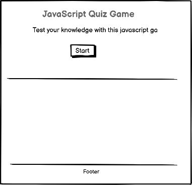
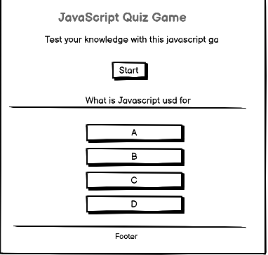
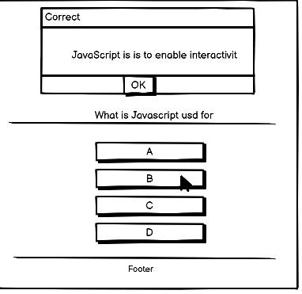
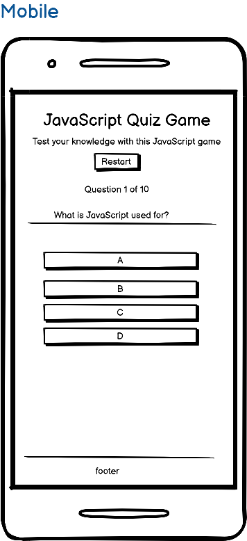

<h1 align='center'> Task Manager </h1>

View live project here:
https://enocol.github.io/JavaScript_quiz_game/

Welcome to the JavaScript quiz game website. The purpose of this site is to enable JavaScript learners to play a game by answering questions in Javascript and see thier score at the end of the game. Each time you start/restart a game, the answers are reshuffled and the answers are reordered to see if you still answer correctly. The explanation of the correct answer is always given in order to enable continued learning.

## Index

- [User Experience](#user-experience-ux)
- [Features](#features)
- [Design](#design)
- [Technologies Used](#technologies-used)
- [Testing](#testing)
- [Deployment](#deployment)
- [Future Features](#future-features)
- [Credits](#credits)

## #user-experience-ux

As a user, I want to:

- Access the game website seamlessly across various devices including desktops, laptops, tablets, and mobile phones.
- See a distinct title of the game and be able to click a button to start the game
- Experience a consistent layout and design across game site
- Could take me back to the start of the game at any point during the game
- Be able to see and be informed if my selection after each answer is correct or not
- Be able to read the explanation of the correct answer in order to learn
- Be able to see my final score at the end of the quiz
- Be able to Restart the game at the end of the quiz

## Features

- The quiz Title
- A brief discription of the game
- A Start Button
- A restart Button while quiz is running
- A restart button at the end of the game
- View score at the end of the game
- A footer with copyright information

## Design

### Wire Frames

- Desktop View

- Mobile

### Fonts

'macondo, Roboto and lato google fonts are used for its combination of readability, professionalism, and widespread availability.

### Color Scheme

Colors ( Goldenrod, blue and sky blue ) are chosen for a clean and simple website design that keeps the focus on the content.

## Technologies Used

- **Languages**

  - HTML5
  - CSS3
  - JavaScript

- **Libraries & Programs Used**
  - GitHub: used for creating and maintaining the project repository.
  - Visual Studio code for development
  - Bootstrap and Custom css: leveraged for developing visually appealing and responsive websites, tailored to project requirements.
  - Balsamiq for wireframe

## Testing

## Manual Testing

| **TEST**            | **ACTION**           | **EXPECTATION**                                       | **RESULT**         |
| ------------------- | -------------------- | ----------------------------------------------------- | ------------------ |
| Start game Button   | Button clicked       | quiz starts                                           | Worked as expected |
| Answer Buttons      | Button clicked       | opens popup dialog                                    | Worked as expected |
| Restart Button      | Button clicked       | Resets the score to zero and back to a new Question 1 | Worked as expected |
| Page Resposiveness  | Change screen size   | To fit nicely on different screen sizes               | Worked as expected |
| Page Responsiveness | View on Mobile phone | To fit nicely and be usable                           | Worked as espected |

## Deployment

To deploy this page to github page from its repository, the following steps were taken:

- Click on settings in the github repo
- On the left hand site click on pages
- Select the source and branch you want to deploy from

## Future Features

Features which could be implemented in the future:

- Add a timer
- A Contact page

## Bugs encounted during developement

- Horizontal scrolling
- Correct/wrong answers not properly reported
- Restart button not displayed at end of game

- **Feedback :**
  - I will be very greatful to get a feedback and proposal for improvement of this quiz game

### credits

- Code Institute LMS.
- Google (images)
- Bootstrap CSS for more styling and responsiveness
- Stackoverflow for helping out with shuffleArray function

### Author

- [Enoh Collins](https://github.com/enocol)
