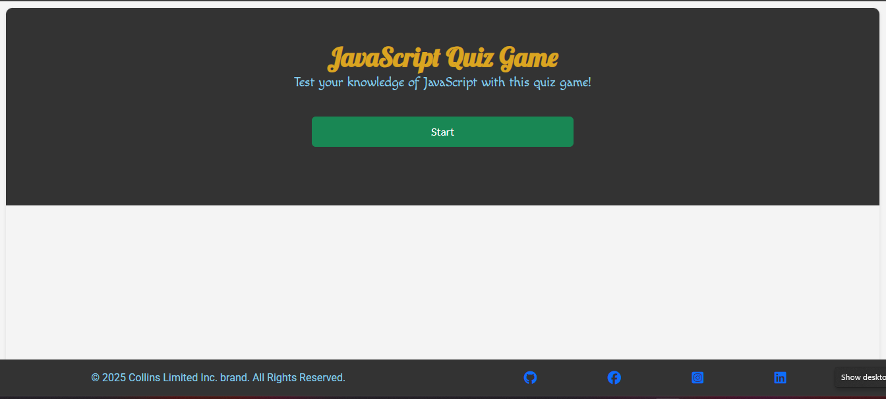
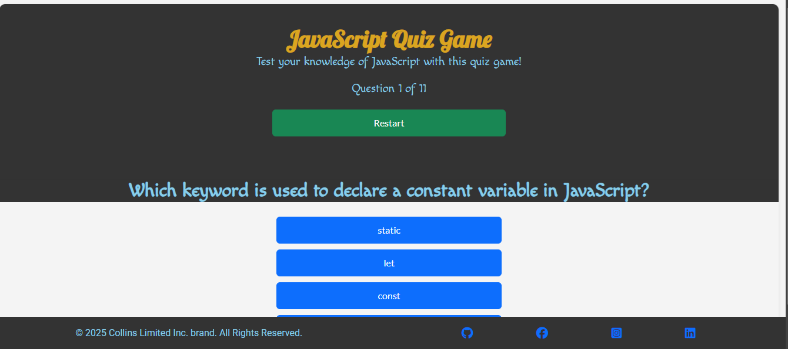
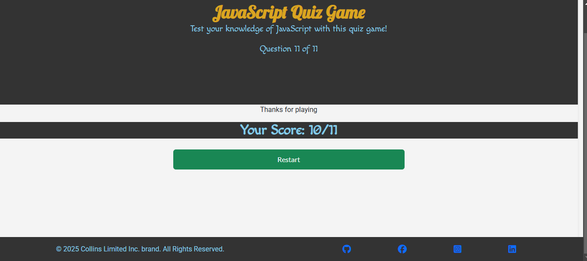
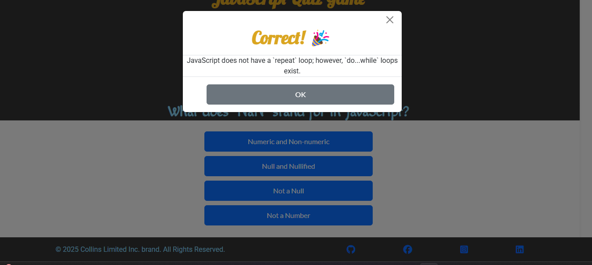
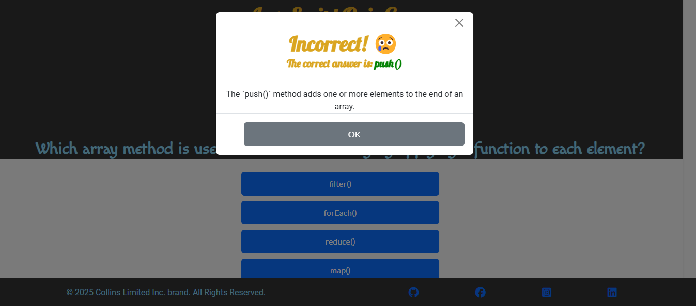
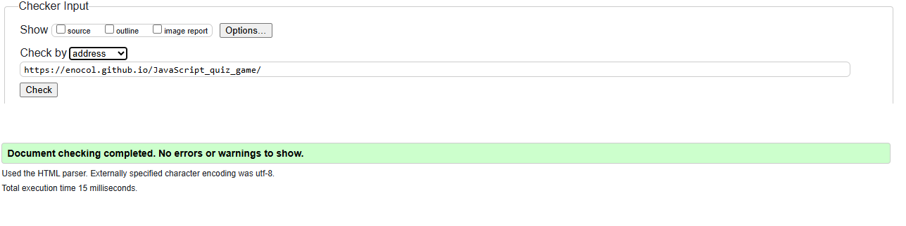
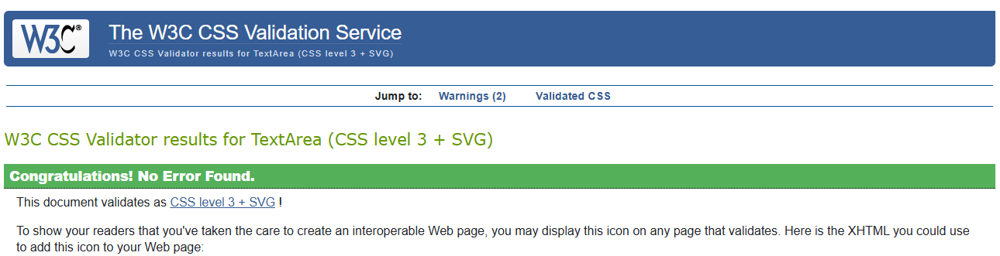
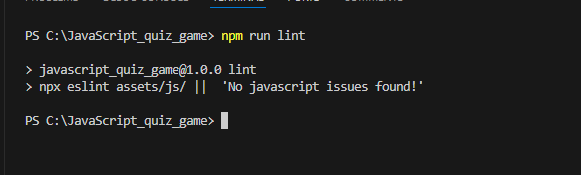
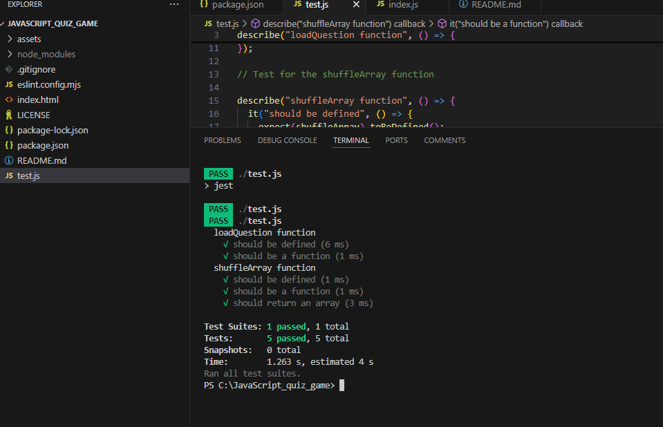

<h1 align='center'> JavaScript Quiz Game </h1>

Welcome to the JavaScript quiz game website. The purpose of this site is to enable JavaScript learners to play a game by answering questions in Javascript and see thier score at the end of the game. Each time you start/restart a game, the questions are reshuffled and the answers are reordered to see if you still answer correctly. The explanation of the correct answer is always given after each response in order to enable continued learning.

## Index

- [User Experience](#user-experience-ux)
- [Features](#features)
- [Design](#design)
- [Technologies Used](#technologies-used)
- [Testing](#testing)
- [Notes for testing](#Notes-for-testing)
- [Deployment](#deployment)
- [Future Features](#future-features)
- [Credits](#credits)

## #user-experience-ux

As a user, I want to:

- Access the game website seamlessly across various devices including desktops, laptops, tablets, and mobile phones.
- See a distinct title of the game and be able to click a button to start the game
- Experience a consistent layout and design across game site
- Could take me back to the start of the game at any point during the game
- Be able to see and be informed if my selection after each answer is correct or not
- Be able to read the explanation of the correct answer in order to learn
- Be able to see my final score at the end of the quiz
- Be able to Restart the game at the end of the quiz

## Features

- The quiz Title and Start Button

  - 

    
    

- A restart Button while quiz is running
  - 

    
    

- A restart button at the end of the game
  - 

      
      

- Modal to reporting action after selecting answer

  - 

        
        

  - 

    
    

- A footer with copyright information

  - 

    
    

## Design

### Wire Frames

- Desktop View

- Mobile

### Fonts

'macondo, Roboto and lato google fonts are used for its combination of readability, professionalism, and widespread availability.

### Color Scheme

Colors ( Goldenrod, blue and sky blue ) are chosen for a clean and simple website design that keeps the focus on the content.

## Technologies Used

- **Languages**

  - HTML5
  - CSS3
  - JavaScript

- **Libraries & Programs Used**
  - GitHub: used for creating and maintaining the project repository.
  - Visual Studio code for development
  - Bootstrap and Custom css: leveraged for developing visually appealing and responsive websites, tailored to project requirements.
  - Balsamiq for wireframe

## Testing

# html and css validation

## HTML Validation

- 

  
  

## css validation

- 

  
  

## ESLint

## Javascript validation

- To test Javascript with a Linter, on your local terminal, type **npm run lint**
  and your results should be similar to the imzge below

- 

  
  

## Manual Testing

| **TEST**            | **ACTION**           | **EXPECTATION**                                        | **RESULT**         |
| ------------------- | -------------------- | ------------------------------------------------------ | ------------------ |
| Start game Button   | Button clicked       | quiz starts                                            | Worked as expected |
| Answer Buttons      | Button clicked       | opens popup dialog                                     | Worked as expected |
| Restart Button      | Button clicked       | Resets the score to zero and back to a new Question 1  | Worked as expected |
| Page Resposiveness  | Change screen size   | To fit nicely on different screen sizes                | Worked as expected |
| Page Responsiveness | View on Mobile phone | To fit nicely and be usable                            | Worked as expected |
| Report correct ans  | Run quiz             | Answer should match the correct key in question Object | Worked as expected |
| Randon questions    | Rub quiz twice       | Question are shuffed on each quiz rann                 | Worked as expected |
| Ranswer answers     | Rub quiz twice       | Answer are shuffed on each quiz ran                    | Wored as expected  |

## Automatic Testing with Jest

- To run automatic testing, on your local terminal within the project directory, run ** npm run test** and you your results should be similar to the image below

- 

  
  

## Notes-for-testing

## Manual Testing Principles

-- Human Involvement – Testers execute test cases manually without scripts or tools.

-- Exploratory Testing – Testers use intuition and experience to find bugs not covered by predefined test cases.

-- Flexibility – Useful for UI/UX evaluation and usability testing.

-- Ad-hoc Testing – Can be performed spontaneously without documentation.

-- Error Guessing – Experienced testers can predict potential failure points.

When to Use Manual Testing

1. Exploratory Testing – When requirements are unclear or evolving.
2. Usability Testing – To check user experience, UI consistency, and accessibility.
3. Small Projects – When automation is unnecessary due to limited scope.
4. Ad-hoc Testing – To quickly check for defects without formal test plans.
5. Short-Term Testing – When the time or budget doesn’t justify automation.

Automated Testing Principles
-- Scripted Execution – Uses test scripts or frameworks to run predefined test cases.

-- Repeatability – The same test can be run multiple times with consistent results.

-- Fast Execution – Reduces testing time compared to manual testing.

-- Scalability – Handles large-scale tests, such as load or regression testing.

-- CI/CD Integration – Supports continuous testing in DevOps pipelines.

When to Use Automated Testing

1. Regression Testing – To check that new code changes don’t break existing functionality.
2. Performance & Load Testing – To simulate multiple users or heavy loads.
3. Frequent Code Changes – In Agile and DevOps environments where tests need to be run often.
4. Large-Scale Applications – When manual testing is too time-consuming.
5. Repetitive Tests – For tasks like login verification, form validation, or API testing.

## Deployment

View live project here:
https://enocol.github.io/JavaScript_quiz_game/

To deploy this page to github page from its repository, the following steps were taken:

## Enable GitHub Pages on Your Repository

## Navigate to GitHub Pages Settings:

- On your GitHub repository page, click on the Settings tab at the top of your repository.
  Scroll down to the GitHub Pages Section:

- In the "GitHub Pages" section, you’ll see a dropdown under Source. Select main (or master) as the branch to deploy from.
- For folder: Select / (root) if your index.html is in the root of your repository (i.e., not inside any subfolders).

## Save Settings:

- Click Save or Save Changes. GitHub will now start deploying your site.
- Wait for Deployment to Complete
- In a few minutes: GitHub will automatically deploy your website. This process may take a few minutes.

## Future Features

Features which could be implemented in the future:

- Add a timer
- A Contact page

## Bugs encounted during developement

- Horizontal scrolling
- Correct/wrong answers not properly reported
- Restart button not displayed at end of game

- **Feedback :**
  - I will be very greatful to get a feedback and proposal for improvement of this quiz game

### credits

- Code Institute LMS.
- Google (images)
- Bootstrap CSS for more styling and responsiveness
- Stackoverflow for helping out with shuffleArray function

### Author

- [Enoh Collins](https://github.com/enocol)
